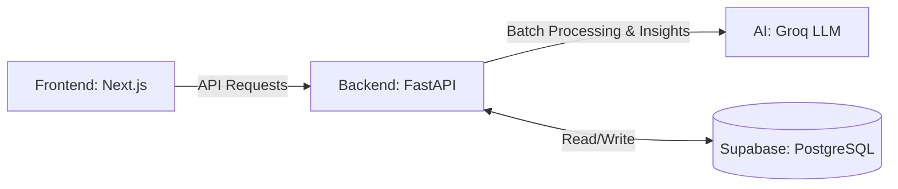

# ReviewPulse 📊  
**Restaurant Feedback Analysis Platform**

## 📖 Overview  
ReviewPulse is an AI-powered analytics platform designed specifically for restaurants. It allows owners to upload raw customer reviews (via CSV) and uses advanced AI to automatically categorize feedback, extract sentiment, and deliver actionable insights. Stop guessing what your customers want, and let data drive your decisions.

---

## ✨ Features  
- **Automated Processing:** Upload your CSV file and instantly process reviews in batches.
- **Restaurant-Specific Categories:** AI classifies feedback into critical areas: `staff`, `food_quality`, `ambience`, `wait_time`, and `hygiene`.
- **Sentiment Extraction:** Determines if feedback is positive (strength), negative (issue), or neutral (observation).
- **AI-Generated Insights:** Uses LLMs to read through parsed data and provide detailed, natural-language summaries, key findings, and actionable steps to improve business health.
- **Dynamic Alerts:** Auto-generates critical notifications based on negative feedback spikes and repeated complaints.
- **Live Dashboard:** Visualizes trends, positive/negative rates, and issues/strengths breakdowns in real time.

---

## 🏗️ Architecture  


---

## 💻 Tech Stack  

**Frontend**  
- Next.js 16 (App Router)
- React 19 & TypeScript
- Tailwind CSS v4 & Recharts

**Backend & AI**  
- FastAPI (Python)
- Groq LLM (High-speed AI Inference)
- SQLAlchemy (ORM)

**Database**  
- PostgreSQL (Hosted on Supabase via Connection Pooling)

---

## ⚙️ Local Setup

Follow these steps to run the project locally on your machine.

### 1. Database Configuration
Create a PostgreSQL database on Supabase and copy your *Connection Pooling* (Supavisor) URL (typically port 6543).

### 2. Backend Setup
```bash
# Create and activate virtual environment
python -m venv myenv
myenv\Scripts\activate  # On Windows

# Install dependencies
pip install -r requirements.txt

# Create a .env file in the root
DATABASE_URL=your_supabase_pooler_url_here?sslmode=require
GROQ_API_KEY=your_groq_api_key_here

# Run the server
uvicorn backend.main:app --reload
```
*Backend runs on `http://127.0.0.1:8000`*

### 3. Frontend Setup
```bash
cd frontend-v2

# Install dependencies
npm install

# Create a .env.local file in the frontend directory
NEXT_PUBLIC_API_URL=http://127.0.0.1:8000

# Start the app
npm run dev
```
*Frontend runs on `http://localhost:3000`*

*(Note: We have provided a `sample_reviews.csv` at the root of the project to test the software.)*

---

## 🚀 Deployment  
- **Backend:** Deployed on **Render** (as a Web Service with Gunicorn).
- **Frontend:** Deployed on **Vercel** (connects directly to your GitHub repository).
- **Database:** Hosted securely on **Supabase**.

---

## 📝 Example Output  

**Input (Raw CSV Data):**  
> *"The pasta was cold, but the waiter was incredibly friendly and gave us a free dessert."*

**AI Output (Processed):**  
- **Issue Detected:** `food_quality` (Sentiment: Negative) ⚠️
- **Strength Detected:** `staff` (Sentiment: Positive) 💪

**AI Generated Insight:**
> *"Consider reviewing kitchen hold times. Wait staff is doing an excellent job recovering from food temperature issues, but reducing time under the heat lamp will improve overall food quality scores."*

---

## 🔮 Future Improvements  
- **Real-Time Integrations:** Automatically fetch live reviews from platforms like Zomato, Swiggy, and Google Reviews via APIs.
- **Competitor Analysis:** Compare sentiment scores against local similar restaurants.
- **Automated Responses:** Suggest AI-drafted reply templates based on the specific customer review.

---

## 👨‍💻 Author  

**Prince Jha**  
- 🐙 GitHub: [@princejha-dev](https://github.com/princejha-dev)  
- 💼 LinkedIn: [princejha-dev](https://linkedin.com/in/princejha-dev)
